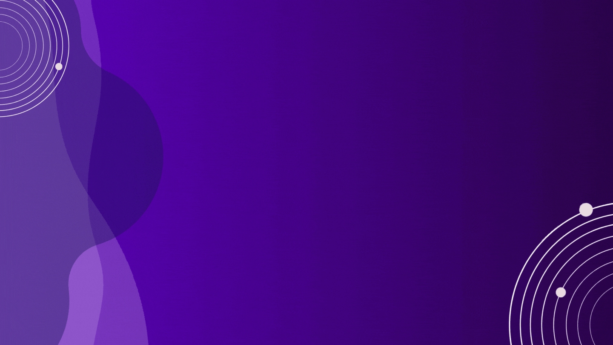

# FellowBuddy 🤖
#### MLH kick-off hackathon Project - FellowBuddy Discord Bot
FellowBot
Hi there ! :wave:

This is FellowBot - an MLH kickoff project, a bot and your friend!.
We understand how sometimes life in particular can be difficult and since we are now MLH Fellows, we thought of making something which can be used by every fellow in the server and which makes their life easy.

The project is a discord bot with the following features:
- 🧠 Mental health support - We understand how stressful it can be to manage everything and keep a positive attitude. Come talk to FellowBot about stress, life and unwanted feelings and it will help you!. Have difficulty managinng time? It will recommend you techniques to stay focused. Having a bad day? It will tell you a joke too!. Want motivation? Well, FellowBot will send you an inspiational quote too!.
- ✨ Handbook scraping - We understand that you might not remember every page of the handbook but we also agree it is your best friend in this fellowship!. So, need to search for a particular page? Just type in a relevant keyword from our list of keywords and have the information directly in your discord. Say goodbye to searches again!

### Technologies used
